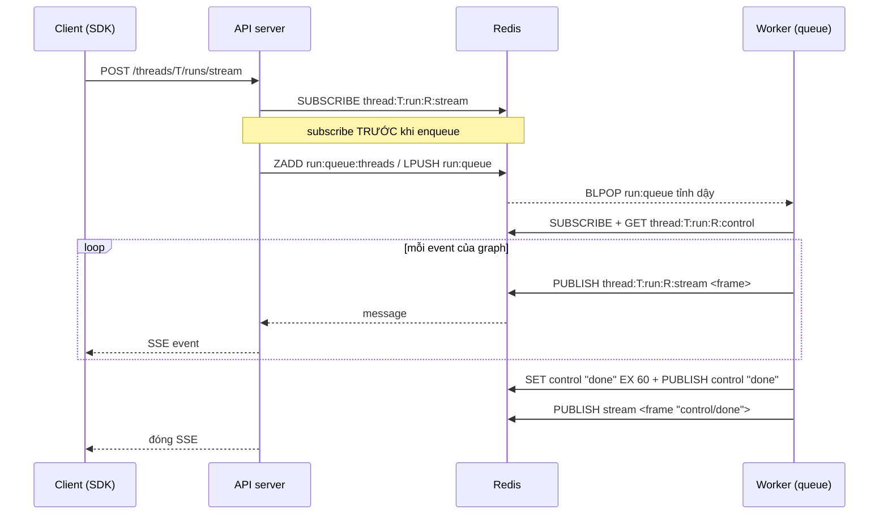

# LangGraph #1: Stream event từ worker về client (`thread:<t>:run:<r>:stream`)

> **Nguồn:** chạy thật image `langchain/langgraphjs-api:24` (cùng image với `ff` prod) với Redis và Postgres tạm, cộng một graph demo 3 node (mỗi node ngủ 1.5 giây). `MONITOR` ghi lại mọi lệnh Redis. Ngày 2026-10-01.
> ✅ = thấy tận mắt trong `MONITOR` / SSE · 🔍 = suy luận
> **Đọc trước:** Bài 6, 7 trong [LangGraph-Runtime-UseCases.md](./LangGraph-Runtime-UseCases.md) và [redis-stream.md](./redis-stream.md).
> **Bài tiếp theo:** [langgraph-02-thread-stream-cache.md](./langgraph-02-thread-stream-cache.md)

## TL;DR

1. `thread:<t>:run:<r>:stream` là một **Pub/Sub channel**, không phải Redis Stream. Worker `PUBLISH` từng event, API server `SUBSCRIBE` rồi đẩy ra SSE cho client. ✅
2. Khi client gửi `stream_resumable: true`, mỗi event được **ghi thêm** vào Redis Stream `thread:<t>:cache` trong cùng một Lua script (`XADD` rồi `PUBLISH`). ID của entry trong Stream chính là dòng `id:` của SSE, tức là `Last-Event-ID`. ✅
3. Khi reconnect, server **`SUBSCRIBE` trước, `XRANGE` sau**, nên không hở event nào. Event bị trùng thì bỏ dựa theo ID. ✅

> ⚠️ **Đính chính Bài 7** trong file UseCases: hôm trước mình viết `thread:<t>:run:<r>:stream` là Stream có `XADD`. Chạy thật thì thấy sai: đó là channel Pub/Sub. Stream thật là `thread:<t>:cache`.

---

## 1. Ai nói chuyện với ai



## 2. Các key liên quan

| Key | Kiểu | TTL | Khi nào có |
|---|---|---|---|
| `thread:<t>:run:<r>:stream` | **Pub/Sub channel**. Không phải key, nên `SCAN` không bao giờ thấy | — | luôn luôn ✅ |
| `thread:<t>:cache` | **Stream** | 120s, gia hạn sau mỗi event | chỉ khi `stream_resumable: true` ✅ |
| `thread:<t>:run:<r>:control` | String `"done"` / `"interrupt"` **và** channel cùng tên | 60s | khi run kết thúc hoặc bị cancel ✅ |

TTL 120 giây đến từ `RESUMABLE_STREAM_TTL_SECONDS`, mặc định là 120 (đọc trong `langgraph_api/config`). ✅

---

## 3. Trace thật: chế độ thường (`stream_resumable: false`)

Đã lọc bớt nhiễu (heartbeat, `BLPOP` của worker rảnh). `<T>` là thread id, `<R>` là run id.

```text
subscribe  thread:<T>:run:<R>:stream                 ← (1) API nghe TRƯỚC
evalsha …  run:queue:threads run:queue …              ← (2) enqueue: ZADD LT + LPUSH (Bài 3)
set        run:<R>:running 1 ex 120                   ← (3) worker nhận run, heartbeat (Bài 1)
incrby     run:<R>:attempt 1
publish    thread:<T>:run:<R>:stream "\x01\x00\x00\x00\bmetadata{"run_id":…}"
subscribe  thread:<T>:run:<R>:control                ← (4) worker nghe lệnh cancel
get        thread:<T>:run:<R>:control                ←     …và GET phòng khi cancel đã tới trước
publish    thread:<T>:run:<R>:stream "\x01\x00\x00\x00\x06values{"n":0,…}"
publish    thread:<T>:run:<R>:stream "\x01\x00\x00\x00\x06values{"n":1,…}"
…
SET        thread:<T>:run:<R>:control done           ← (5) Lua: SET + EXPIRE 60 + PUBLISH
EXPIRE     thread:<T>:run:<R>:control 60
PUBLISH    thread:<T>:run:<R>:control done
publish    thread:<T>:run:<R>:stream "\x01\x00\x00\x00\acontroldone"   ← (6) API đóng SSE
```

**Cách đọc frame:** các byte đầu là `[version=1][độ dài stream id: 2 byte][độ dài tên event: 2 byte]`, theo sau là stream id, tên event, rồi JSON.

- Ở chế độ thường, độ dài id là `\x00\x00` = 0, vì không có Stream nào được ghi nên không có id.
- `\x00\x08` = 8 = `len("metadata")`. `\x00\x06` = 6 = `len("values")`.
- Hệ quả: SSE trả về **không có dòng `id:`**, nên client không có gì để resume. Rớt mạng là mất event.

> Bước (4) xác nhận phần "đoán" ở Bài 6: worker vừa `SUBSCRIBE` vừa `GET` key control, còn bên gửi `SET` key rồi mới `PUBLISH`. Nhờ đó tín hiệu cancel không bị mất nếu tới trước khi worker kịp subscribe.

---

## 4. Trace thật: resumable, rớt mạng rồi reconnect

Kịch bản: `stream_resumable: true` + `on_disconnect: "continue"`. Client cắt kết nối ở giây thứ 2.4, rồi reconnect bằng `GET /threads/<T>/runs/<R>/stream` kèm header `Last-Event-ID`.

| t (giây) | Lệnh Redis | Ai | Ghi chú |
|---|---|---|---|
| 0.000 | `SUBSCRIBE thread:<T>:run:<R>:stream` | API | |
| 0.043 | `EVALSHA <resumable>` → `XADD thread:<T>:cache * run_id <R> event metadata message …` → `TIME` → `XTRIM … MINID <now-120000>` → `EXPIRE … 120` → `PUBLISH …stream "\x01\x00\x0f\x00\b1790826799062-0metadata…"` | worker | `\x00\x0f` = 15 = độ dài `"1790826799062-0"` ✅ |
| 0.06 / 1.57 | 2 lần `EVALSHA` y hệt cho `values` n=0, n=1 | worker | client nhận đủ, mỗi event có `id:` |
| **2.4** | *(không có lệnh nào)* | client cắt | `on_disconnect: continue` nên run **vẫn chạy** ✅ |
| 3.08 | `XADD …` n=2 + `PUBLISH` | worker | không ai nghe Pub/Sub, nhưng **đã nằm trong Stream** |
| 3.53 | `SUBSCRIBE thread:<T>:run:<R>:stream` | API (reconnect) | **subscribe trước** |
| 3.53 | `EVALSHA <filter>` → `XRANGE thread:<T>:cache 1790826800592-0 +` | API | replay từ `Last-Event-ID` ✅ |
| 4.59 | `XADD …` n=3 + `PUBLISH` | worker | lần này tới qua Pub/Sub (live) |

SSE client nhận được sau khi reconnect: `values n=2` (lấy từ `XRANGE`, đúng event bị lỡ), rồi `values n=3` (live). **Không mất, không trùng.** ✅

Sau khi run xong, `SCAN` thấy `thread:<T>:cache` có `type=stream ttl=119`. ✅

---

## 5. Logic của script publish (mình viết lại, không phải bản gốc)

Bản lab nằm ở [langgraph-lab/resumable-publish.lua](./langgraph-lab/resumable-publish.lua). Logic gồm 4 bước, **trong 1 lần gọi**:

1. `XADD thread:<t>:cache * run_id … event … message …` → nhận về `id`
2. `TIME` → `XTRIM … MINID (now_ms - ttl*1000)` → **cửa sổ trượt 120 giây**
3. `EXPIRE thread:<t>:cache ttl`
4. `PUBLISH thread:<t>:run:<r>:stream <frame có chứa id>`

**Vì sao phải là Lua, không làm 4 lệnh rời từ Go?**

- `PUBLISH` cần cái `id` mà `XADD` vừa sinh ra. Làm rời thì tốn 2 round-trip.
- Thứ tự giữa Stream và Pub/Sub phải khớp tuyệt đối. Nếu 2 worker (hoặc 2 goroutine) cùng publish xen kẽ, dữ liệu replay và dữ liệu live có thể lệch thứ tự nhau. Lua chạy nguyên khối nên không bị chen ngang (Bài 2, 5).
- `TIME` lấy đồng hồ của Redis, nên mọi worker cắt cửa sổ theo cùng một đồng hồ (giống bạn làm ở phase 6).

**Vì sao `MONITOR` thấy `evalsha` chứ không phải `eval`?** Runtime `SCRIPT LOAD` script đúng 1 lần, sau đó chỉ gửi SHA (40 byte) thay vì cả đoạn script. Binary có hàm `ensureScriptLoaded` / `isNoScriptErr` ✅: khi Redis restart thì cache script bị mất, lệnh trả lỗi `NOSCRIPT`, lúc đó runtime load lại.

---

## 6. Sáu quyết định thiết kế đáng học

| # | Quyết định | Nếu làm ngược lại thì sao |
|---|---|---|
| 1 | **Subscribe trước rồi mới enqueue** | Worker nhanh hơn API sẽ `PUBLISH metadata` lúc chưa ai nghe → event đầu mất vĩnh viễn (Pub/Sub không lưu) |
| 2 | **Reconnect: subscribe trước rồi mới replay** | `XRANGE` trước, `SUBSCRIBE` sau → event phát ra giữa 2 lệnh không nằm trong kết quả `XRANGE`, mà cũng chưa có ai nghe → hở |
| 3 | **Bỏ trùng theo ID** | `XRANGE start +` **lấy luôn** entry có ID = `start` (lab bên dưới chứng minh). Server phải bỏ entry đó, và cũng bỏ event live trùng với event vừa replay. Binary có `CompareStreamIDs` ✅ |
| 4 | **2 đường cho 1 event:** Stream để lưu, Pub/Sub để đẩy | Chỉ dùng Stream thì subscriber phải `XREAD BLOCK` liên tục. Đây chính là chế độ "optimized", xem file #2 |
| 5 | **TTL là cửa sổ trượt** (`XTRIM MINID` mỗi lần ghi) | Không trim thì một run dài sinh hàng nghìn event, RAM tăng theo |
| 6 | **Kết thúc bằng `control: done`** (key + channel + 1 frame) | Client join *sau* khi run đã xong sẽ treo mãi chờ event. Lab: join run đã xong mà không gửi `Last-Event-ID` → trả 0 event và đóng ngay ✅ |

---

## 7. Phía client: SDK `@langchain/langgraph-sdk` 1.10.0 (đọc source trong `node_modules`)

`streamWithRetry` (trong `dist/utils/stream.js`):

1. Response của `POST …/runs/stream` có header **`Location: /threads/<T>/runs/<R>/stream`** ✅ (thấy trong lab). SDK nhớ path này.
2. Với mỗi event có `id`, SDK lưu `lastEventId = id`.
3. Khi gặp lỗi mạng hoặc stream bị đứt mà vẫn có `Location`, SDK `GET Location` kèm header `Last-Event-ID`.
4. Backoff: `min(1000 · 2^(n-1), 5000) + random(0..1000)` ms. Tối đa 5 lần, quá thì ném `MaxReconnectAttemptsError`.
5. **Idle watchdog:** server gửi comment `: heartbeat` (thấy trong SSE ✅). Nếu không nhận byte nào trong khoảng ~3 lần chu kỳ heartbeat (tối thiểu 6 giây, tối đa 30 giây), SDK coi như socket chết "half-open" và tự reconnect.

Còn proxy mobile của `ff` thì phải cho header `Last-Event-ID` đi qua ([_proxy.ts:99](../../../P-project/ff/apps/web/src/app/api/mobile/_proxy.ts)). Nếu thiếu, bước 3 sẽ replay từ đầu hoặc không replay được gì.

---

## 8. Liên hệ `ff`

- **Chat** (`packages/chat-core/src/useChatStream.ts`): `streamResumable: true`, `onDisconnect: "continue"`, `multitaskStrategy: "enqueue"`, `reconnectOnMount: false`. Tức là rớt mạng **trong cùng phiên** thì SDK tự nối lại nhờ mục 7. Nhưng reload trang hoặc kill app thì **không** join lại (cơ chế đó nằm ở file #2).
- **Prod `ff` chạy đúng chế độ trong file này.** Compose không set `FF_OPTIMIZED_STREAMING`, và lab với image `:24` mặc định đi theo đường Pub/Sub ✅. Phần "prod cũng mặc định như vậy" là 🔍, vì cùng image tag nên rất có thể giống.
- **Giới hạn thật cần biết:** cửa sổ chỉ 120 giây. User mất mạng **quá 2 phút** thì các event cũ hơn 2 phút đã bị `XTRIM`, replay sẽ thiếu đoạn đầu. Vì vậy `usePdfImportStream` mới hydrate lại từ `ThreadState.values` trong `onFinish`: **Redis chỉ là buffer tạm, nguồn sự thật là checkpoint Postgres.**

---

## 9. Lab: tự dựng lại cơ chế resumable trên `redis-learn` (DB 15)

Script ở [langgraph-lab/](./langgraph-lab/). Chạy từ thư mục `lessons/`. Load script đúng kiểu LangGraph làm (`SCRIPT LOAD` rồi `EVALSHA`):

```bash
cat langgraph-lab/resumable-publish.lua | docker exec -i redis-learn redis-cli -n 15 -x SCRIPT LOAD
```

```bash
cat langgraph-lab/filter-by-run.lua | docker exec -i redis-learn redis-cli -n 15 -x SCRIPT LOAD
```

Ghi lại 2 SHA vừa nhận được, gọi là `<PUB>` và `<FIL>`.

**Terminal A** (đóng vai API server):

```bash
docker exec -it redis-learn redis-cli -n 15 SUBSCRIBE thread:t1:run:r1:stream
```

**Terminal B** (đóng vai worker), mở `redis-cli -n 15`:

```
EVALSHA <PUB> 2 thread:t1:cache thread:t1:run:r1:stream '{"run_id":"r1"}' metadata 120 r1
EVALSHA <PUB> 2 thread:t1:cache thread:t1:run:r1:stream '{"n":1}' values 120 r1
```

A nhận được `…-0|metadata|…` và `…-0|values|{"n":1}`. **Ghi lại ID của event `n=1`**, đó là `Last-Event-ID`.

Giờ **Ctrl+C ở A** (giả lập rớt mạng). Ở B phát tiếp:

```
EVALSHA <PUB> 2 thread:t1:cache thread:t1:run:r1:stream '{"n":2}' values 120 r1
```

Reconnect đúng thứ tự: **A `SUBSCRIBE` lại trước**, rồi ở B:

```
EVALSHA <FIL> 1 thread:t1:cache r1 <ID của n=1>
```

**Tự làm:**

1. Kết quả replay có mấy entry? Vì sao thấy cả `n=1` mà client đã nhận rồi?
2. Sửa sao cho không trùng. Có 2 cách: một cách sửa ở Redis, một cách sửa ở code.
3. Đảo thứ tự (replay trước, `SUBSCRIBE` sau), và trong lúc đó publish `n=3` từ terminal thứ ba. `n=3` có tới được A không?
4. `TTL thread:t1:cache` là bao nhiêu? Publish thêm 1 event rồi xem lại TTL. Nó thay đổi thế nào?

<details><summary>Đáp án</summary>

1. 2 entry (`n=1`, `n=2`). `XRANGE start end` **bao gồm** cả `start`. Đã chạy thử: truyền ID của `n=1` thì nhận về cả `n=1` lẫn `n=2`.
2. Sửa ở Redis: `XRANGE key (<id> +`. Dấu `(` nghĩa là loại trừ, có từ Redis 6.2. Sửa ở code: bỏ entry có `id == Last-Event-ID` (LangGraph làm cách này, nhờ đó còn khử trùng được cả giữa phần replay và phần live).
3. Có thể không tới. Nếu `n=3` được publish sau lúc `XRANGE` chạy nhưng trước lúc `SUBSCRIBE`, nó không có trong kết quả `XRANGE`, và Pub/Sub thì chưa có ai nghe. Đó là lý do của quyết định #2.
4. ~120, rồi **reset về 120** sau mỗi event (`EXPIRE` được gọi lại). Key chỉ chết sau 120 giây *không có event nào*.

</details>

Dọn dẹp (chỉ trong DB 15):

```bash
docker exec redis-learn redis-cli -n 15 FLUSHDB
```

---

## 10. Câu hỏi tự kiểm

1. Vì sao `SCAN` không bao giờ thấy `thread:<t>:run:<r>:stream`?
2. Một worker crash giữa run, sweeper giao run cho worker khác (Bài 1), và run chạy lại từ checkpoint. Client đang resume sẽ thấy gì trong Stream?
3. Vì sao LangGraph không dùng consumer group (`XREADGROUP`) cho Stream này?
4. Chuyện gì xảy ra nếu đặt `RESUMABLE_STREAM_TTL_SECONDS=0`?

<details><summary>Đáp án</summary>

1. Channel Pub/Sub không phải key, nó không tồn tại trong keyspace. Muốn xem thì dùng `PUBSUB CHANNELS 'thread:*'`.
2. 🔍 Event của lần chạy thứ 2 được `XADD` nối tiếp vào **cùng** `thread:<t>:cache`, nên client có thể nhận một số event "lặp lại" (ví dụ `metadata` với `attempt: 2`). Client phải dựa vào `values` cuối cùng hoặc checkpoint, chứ không cộng dồn event.
3. Consumer group dùng để chia việc, mỗi message chỉ giao cho 1 consumer. Ở đây mỗi tab hoặc thiết bị cần **tất cả** event, tức là fan-out và replay.
4. Theo logic script: `ttl = 0` thì bỏ qua `XTRIM` và `EXPIRE`, nên Stream **không bao giờ hết hạn và không bị cắt**, tức là rò RAM trên một instance `noeviction` (Bài 9). Đừng làm vậy.

</details>

---

## Nguồn & độ tin cậy

- Trace `MONITOR` và SSE: tự chạy, image `langchain/langgraphjs-api:24` (langgraph-api 0.12.3), không set `FF_OPTIMIZED_STREAMING`. ✅
- Logic Lua: đọc từ binary `core-api-grpc` rồi **viết lại**. Bản gốc là mã độc quyền nên không chép vào đây.
- SDK: `@langchain/langgraph-sdk` 1.10.0, các file `dist/utils/stream.js` và `reconnect.js`. ✅
- Bản dev in-memory mã nguồn mở `@langchain/langgraph-api` 1.4.4 (`dist/storage/ops.mjs`) có cùng ý tưởng: `Queue` có cờ `resumable`, đọc theo `lastEventId`. Đọc nó để thấy logic khi không có Redis.
